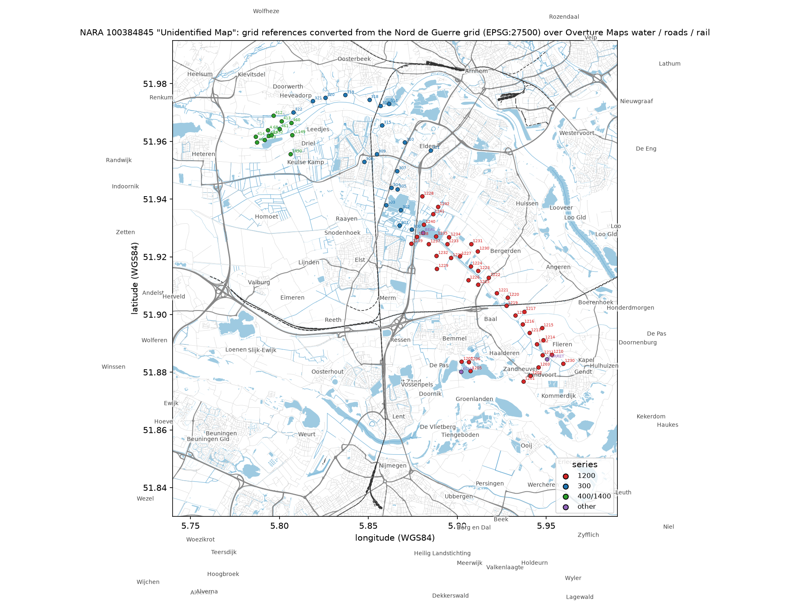
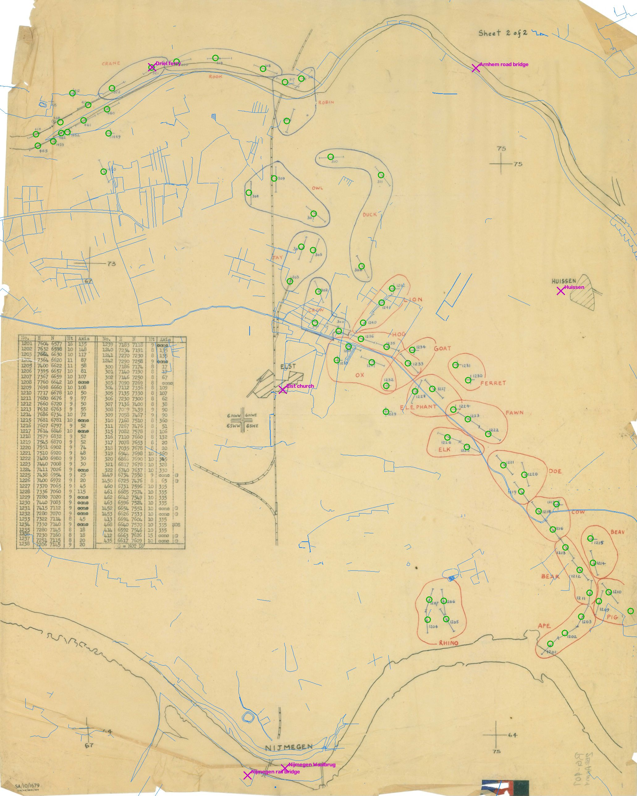

# The Island Trace

Identification and georeferencing of NARA 100384845, "Unidentified Map": a British Second Army Royal Artillery
defensive-fire trace of the Nijmegen bridgehead ("the Island"), October 1944. The story page is in `site/`; this
file is the evidence report. General tools live in [bradleylab/mystery-solver](https://github.com/bradleylab/mystery-solver).

**Subject file:** [File:Unidentified Map - NARA - 100384845.jpg](https://commons.wikimedia.org/wiki/File:Unidentified_Map_-_NARA_-_100384845.jpg)
(5,836 × 7,289 px, 5.08 MB), NARA National Archives Identifier (NAID) [100384845](https://catalog.archives.gov/id/100384845).

## Summary of findings

| Question | Answer | Confidence |
|---|---|---|
| Geographic area | The **"Island" (Betuwe)** between the river Waal and the Nederrijn in Gelderland, Netherlands: from the Waal dyke east of Nijmegen (Bemmel – Haalderen – Gendt) north past Elst and Elden to the Nederrijn, and west along the river to Driel and Heteren (bounding box of the map's own coordinates: 5.787–5.960 °E, 51.877–51.976 °N). | High |
| What it is | **Sheet 2 of 2 of a British Royal Artillery defensive-fire (DF) task trace**: a 1:25,000 tracing-paper overlay of the Island showing 74 numbered DF targets (linear targets drawn as lines with end ticks, concentrations as crosses) grouped into code-named target areas, with a table of grid reference, height and axis for each; legend "⊗ = NOT DF". Drawn to lie over GSGS 4427 *Holland 1:25,000* sheets **6 NW (Arnhem)** and **6 SW (Nijmegen)**, East and West halves. | High (read from the sheet) |
| Date | **October 1944.** The printer's imprint under the serial reads "[?]/10/44/519 RE/1679": printed 10/44 by 519 Field Survey Company RE, one of British Second Army's field survey companies. This falls inside the window (28 September – 9 November 1944) in which Second Army held the Island, and the targets trace the German-held perimeter of that bridgehead. | High |
| Source / series it derives from | NARA **RG 407, Records of the Adjutant General's Office, series "World War II Records" (NAID 3054040)**, file unit **"2nd Army" (NAID 74003525)**, local identifier **"2nd Army Folder 19 – Overlays"**, scan `RG_407_2ndArmy_Fldr19_scan911.jpg`. The folder holds British Second Army / 21st Army Group Royal Artillery traces and fire plans of 1944–45. Producer per the imprint: **519 Field Survey Company RE (Second Army), serial SA/10/1679**. The base map the overlay refers to is GSGS 4427 (= AMS M831), Holland 1:25,000, Nord de Guerre Zone grid. | High (catalog record recovered verbatim; imprint read from the scan) |
| Georeference | Coordinate system of the map: **Nord de Guerre Zone grid = EPSG:27500** ("ATF (Paris) / Nord de Guerre"). The scan is georeferenced from its five labelled grid crosses (E 67/70/75 km, N 64/70/73/75 km) with an **RMS residual of 16.9 m (≈3 px)**: `data/source/*_ndg.tif` (GeoTIFF, EPSG:27500) + `.jgw` world file; footprint 5.775–5.963 °E, 51.847–51.989 °N (`data/derived/scan_footprint_wgs84.geojson`). All 74 grid references printed on the sheet are also converted to WGS84 in `data/derived/ocr_points_wgs84.{csv,geojson}`. | High |



### What the sheet shows (from the image)



*Verification overlay (`figures/georef_verification_overlay.jpg`): green circles are the table's 74 grid references projected
through the fitted transform — each sits on its drawn target cross; magenta marks are modern landmark coordinates
(Elst church, Huissen, the Nijmegen road and rail bridges, the Arnhem road bridge, the Driel ferry) and thin blue lines are
Overture Maps river and canal outlines.*

* A traced base of the Nederrijn (top), the Waal (bottom, with NIJMEGEN and its two bridges), the Nijmegen–Elst–Arnhem railway,
  the roads at ELST and the built-up block of HUISSEN; grid crosses labelled 67/73, 67/64, 75/75, 75/64 and the double-line
  sheet-corner cross labelled 6NWW / 6NWE / 6SWW / 6SWE at grid 70/70.
* **Red block, targets 1201–1242**, grouped into mammal-named areas RHINO, APE, PIG, BEAR, BEAV(ER), COW, DOE, ELK, FAWN,
  ELEPHANT, FERRET, OX, GOAT, HOG, LION, running from the Waal dyke south of Haalderen north-west to the east side of Elst.
* **Blue block, targets 300–322 and 412–414, 460–468, 1449–1453**, grouped into bird-named areas CROW, JAY, OWL, DUCK, ROBIN,
  ROOK, CRANE, from Elst north to the Nederrijn at Elden and west along the river to Driel–Heteren.
* Table "No. | E | N | Ht | Axis" for every target, "conc" for concentrations, and the legend **"⊗ = NOT DF"** marking the
  few targets that are not defensive-fire tasks.
* Bottom left, the reproduction serial **"SA/10/1679"** with a smaller printer's line beneath it reading
  **"[?]/10/44/519 RE/1679"** (`figures/imprint_SA-10-1679.png`; the first character is not legible on this copy):
  the sheet was reproduced in October 1944 by 519 Field Survey Company, Royal Engineers — with 521 Field Survey Company one
  of the two survey companies that landed with British Second Army in June 1944 and provided its artillery survey and map
  reproduction. "SA" is therefore read as Second Army. Bottom right, NARA's pencil annotation "RG 407" / "2nd Army … Fldr 19"
  and a colour-control patch from scanning.
* The overlay is at the base-sheet scale: 8 grid kilometres span 1,333 px on the 2,062-px copy, i.e. 4 cm per km
  (1:25,000) on the 300-dpi original.

### Raster georeference

`pipeline/04_georef.sh` on the 2,062 × 2,576 px copy (the original is 5,836 × 7,289 px, exactly 2.830× larger;
`data/derived/gcps_fullres_5836x7289.csv` carries the same GCPs scaled for it):

| item | value |
|---|---|
| GCPs | 5 labelled grid crosses (`data/derived/gcps_userscopy.csv`), auto-detected as the intersection of the darkest row and column |
| fit | least-squares affine, EPSG:27500 |
| residuals | 15.7, 20.0, 19.3, 16.0, 12.1 m — **RMS 16.9 m** (≈3 px on the copy, ≈1.2 px on the original) |
| pixel size | 6.03 × 5.96 m (copy); rotation of the sheet 0.75° |
| world file | `6.033986 0.079118 0.041814 -5.958415 365201.871 578040.609` |
| extent (EPSG:27500) | E 365 202 – 377 752, N 562 692 – 578 204 |
| extent (WGS84) | 5.775–5.963 °E, 51.847–51.989 °N |
| outputs | `data/source/…_userscopy_georef.tif` (EPSG:27500), `…_userscopy.jgw`; the WGS84 warp `…_warped.tif` is regenerated by the pipeline and not committed |


See `METHODS.md` for how each finding was obtained and which ones rest on search-result summaries rather than primary pages.

## Evidence chain (all reproducible from this repository)

### 1. The NARA catalog record behind the Commons file

Commons and `catalog.archives.gov` were both unreachable here, but NARA publishes its complete catalog on the
AWS Registry of Open Data (`s3://nara-national-archives-catalog`, anonymous). `pipeline/01_catalog.sh` (`mystery-solver nara-find`)
scans the Record Group 407 description dump and finds the item (chunk `rg_407-357.jsonl`). The verbatim record is saved
as `data/nara_catalog/naId_100384845_Unidentified_Map.json`. Key fields:

* ancestors: RG 407 *Records of the Adjutant General's Office* → series *World War II Records* (NAID 3054040, ca. 1941–ca. 1947,
  creator "War Department. The Adjutant General's Office") → file unit *2nd Army* (NAID 74003525)
* `localIdentifier`: **"2nd Army Folder 19 -Overlays"**, container "Folder 19", loose paper sheet, held by the Cartographic
  Branch, College Park
* digital object: `RG_407_2ndArmy_Fldr19_scan911.jpg`, **5,323,421 bytes** — identical to the Commons file size
  (5,323,421 B / 1,048,576 = 5.08 MiB, which Commons displays as "5.08 MB")
* NARA's own OCR of the scan (`extractedText`), which is the basis of everything below.

NARA describes series 3054040 as maps, overlays, city plans and sketches "prepared by Allied armies, corps, divisions and
subordinate engineer components and collected by the Adjutant General's Office", arranged by army unit.

### 2. The folder is British Second Army artillery material

All 15 catalog items of file unit 74003525 are in `data/nara_catalog/fileUnit_74003525_2nd_Army_Folder19_items.json`
(found with the same scan for `"naId":74003525`). The neighbouring scans in Folder 19 are:

| scan | NAID | title |
|---|---|---|
| 903 | 225275022 | Route Intelligence Overlay Sheet G – River Weser |
| 904 | 100384843 / 225275024 | Route Intelligence Overlay E Sheet C – River Rhine |
| **911** | **100384845** | **Unidentified Map (this file)** |
| 912 | 225275026 | Fire Plan for Attack by 3 British Infantry Division, Operation "Constellation", 11 October 1944 |
| 913 | 225275028 | Royal Artillery 12 Corps Reference Point Trace for Operation "Mallard" |
| 914 | 100384851 / 225275030 | Royal Artillery 51 Highland Division, Operation "Collin" |
| 915 | 225275032 | Operation "Spring", 24 July 1944 |
| – | 100384424 | Types of Soil Overlay Sheet 4 |
| – | 225274180–189 | Route Intelligence Overlays Sheets K–N – Elbe-Trave Canal, Kiel Canal |

The U.S. Second Army never served in Europe; "2nd Army" here is the **British Second Army** (21st Army Group), whose
Royal Artillery traces and fire plans fill the folder. Operation "Constellation" (3rd British Division's attack towards Overloon, dated 11 October 1944 in the catalog
title) places the neighbouring sheet in the same autumn.

### 3. What is written on the sheet (from NARA's OCR)

`pipeline/02_grid.sh` (`mystery-solver grid-convert`) parses the OCR text. It contains:

* "Sheet 2 of 2", a serial "SA/10/1679", column headers **"No. | E | N | Ht | Axis"** (two tables side by side);
* place names **NIJMEGEN, ELST, HUISSEN** and sheet labels **"6NW W", "6NW E", "6SW W", "6SW E"** — the four
  East/West half-sheets of GSGS 4427 sheets 6 NW (Arnhem) and 6 SW (Nijmegen), which meet in the middle of the Island;
* code names **CRANE, ROOK, ROBIN, OWL, DUCK, JAY (OCR: "FAY"), LION, CROW, HOG, GOAT, FERRET, ELEPHANT, FAWN, ELK, DOE, COW,
  BEAVER, BEAR, PIG, APE, RHINO** — code names of the defensive-fire (DF) target areas;
* **74 grid references** of the form `7604 6577` (4-digit easting, 4-digit northing = 10 m resolution) attached to target
  numbers 1201–1242, 300–322, 412–414, 460–468 and 1449–1453, each followed by a height ("Ht", 8–20) and either a
  bearing ("Axis", 17–360°) or **"conc"** (concentration, i.e. a point target rather than a linear one).

### 4. The coordinates are Nord de Guerre grid, and they land exactly on the Island

The WWII Allied grid for the Netherlands is the Nord de Guerre Zone (Lambert conformal conic, Clarke 1880 IGN, metres),
EPSG:27500. Four-digit pairs omit the 100-km square. Only one square (E 300 000–400 000, N 500 000–600 000) places the
OCR'd place names correctly; in that square the modern landmarks fall at

| landmark | grid (E N) |
|---|---|
| Nijmegen Waal road bridge | 7087 6329 |
| Elst church | 7077 7059 |
| Huissen centre | 7619 7257 |
| Driel | 6736 7446 |
| Arnhem road bridge | 7450 7684 |

and the sheet's 74 references (E 6592–7760, N 6577–7698) fill the space between them. Independent corroboration:
secondary accounts of the 82nd Airborne's operations quote the Waal crossing at Nijmegen as grid **714633**; its
northing (633) matches the bridge's computed 6329 to within 10 m (search-result quotation, not verified here).

Converted to WGS84 (`data/derived/ocr_points_wgs84.csv`) and plotted over a modern Overture Maps basemap
(`pipeline/03_basemap_dem.sh`), the three numbering blocks form three chains:

* **1201–1242** run from the Waal dyke south of Haalderen north-west via Baal and Bergerden to the east side of Elst
  — the German-held front line east of Bemmel in October 1944;
* **300–322** run from east of Elst north through Elden to the Nederrijn and then west along the river past the Driel
  ferry, with 321–322 on the **north** bank (Westerbouwing heights, German-held);
* **412–414, 460–468, 1449–1453** sit on the south bank between Driel and Heteren, all with the same bearing (335°),
  perpendicular to the dyke there.

Together they outline the perimeter of the Allied bridgehead on the Island as it stood after Market Garden.

### 5. The "Ht" column agrees with real terrain heights

`mystery-solver dem-sample` samples the Copernicus GLO-30 DSM (AWS Open Data) at every point. Median "Ht" on the sheet
is 9 m; median DSM height at the same points is 9.1 m (the Betuwe polder lies 8–10 m above NAP, which is what GSGS 4427
prints). The only large disagreements are the two targets across the river (DSM 43–51 m, the wooded Westerbouwing
bluff), where the OCR pairing of "Ht" tokens is unreliable. Output: `data/derived/ocr_points_dem.csv`.

### 6. Dating

* The sheet is filed among British Second Army Royal Artillery traces of July–October 1944 and route-intelligence overlays
  for the 1945 advance into Germany.
* Its targets lie along the Island perimeter that existed only after Operation Market Garden (bridge at Nijmegen taken
  20 September 1944) and while the sector was British: the 101st Airborne came under British XII Corps on the Island on
  28 September 1944, and First Canadian Army took over the Nijmegen salient on **9 November 1944**. After 2 December 1944
  the eastern Island (where targets 1201–1242 lie) was flooded by the German dyke breach at Elden.
* Hence: **late September – early November 1944**, most likely October 1944. An alternative — the British XXX Corps return
  in February–April 1945 (Operation "Destroyer") — is less consistent with the folder's other contents.

### 7. Whose DF tasks these are

The two colour/number blocks coincide with the two divisional sectors of the Island in October 1944 (sources: the Wikipedia
articles on the Battle of the Nijmegen salient, 50th (Northumbrian) Division, 43rd (Wessex) Division and 101st Airborne
Division; TracesOfWar entries for Driel and the 508th RCT command post at Bemmel):

| block | code names | ground | formation holding that ground, October 1944 |
|---|---|---|---|
| red, 1201–1242 | mammals: RHINO … LION | Waal dyke at Haalderen → Baal → Bergerden → east of Elst | **50th (Northumbrian) Infantry Division**: 151 Brigade attacking toward Baal and Haalderen and 231 Brigade at Bemmel from 3 October; the US **508th Parachute Infantry** relieved 231 Brigade at Bemmel on 6 October under 50th Division command. Static front "for nearly two months" thereafter. |
| blue, 300–322, 412–414, 460–468, 1449–1453 | birds: CROW … CRANE | east of Elst → Elden → Nederrijn bank → Driel → Heteren | **43rd (Wessex) Infantry Division** (Elst taken 25 September; 7th Hampshires on the Nederrijn between Heteren and Driel), handed over to the **US 101st Airborne Division** (506th Parachute Infantry at Driel/Heteren) on 3–5 October, the 101st fighting under British corps command with British artillery support. |

Because a single Second Army sheet carries both sectors' DF tasks, it is most likely a corps- or Army-level compilation
(XXX Corps held the Nijmegen bridgehead; the 101st came under XII Corps) reproduced by 519 Field Survey Company for
distribution; "Sheet 1 of 2" would then cover the remainder of the front (the western Island toward Opheusden, or the
Groesbeek sector south of the Waal). Whether the trace predates or postdates the 3–6 October reliefs cannot be read from
the sheet; the DF numbering blocks would settle it against the CRA war diaries of 50th and 43rd Divisions (UK National
Archives WO 171 series) for October 1944.

## Limitations and what is still open

* The image could not be downloaded from this environment (egress policy blocks `commons.wikimedia.org`,
  `upload.wikimedia.org`, `catalog.archives.gov`, `web.archive.org`, `*.wikipedia.org`, `loc.gov`; NARA's object store
  `s3.amazonaws.com/NARAprodstorage/...` answers `AccessDenied`). The raster work uses a 2,062 × 2,576 px copy supplied by
  the user (`data/source/…_userscopy.jpg`); rerun `pipeline/04_georef.sh` with `gcps_fullres_5836x7289.csv` on
  the original for full resolution.
* The sheet names no formation or operation. The sector attribution in §7 rests on the published order of battle; the
  DF numbering blocks themselves would have to be matched against the CRA war diaries (WO 171) to name the regiments and
  fix the day within October 1944.
* "Sheet 1 of 2" is not among the folder's catalogued scans (905–910 are not described). A scan of every OCR'd item in
  RG 407 for the "SA/10/" serial series or for "Sheet 1 of 2" with the same code names found only this sheet, so the
  companion — which would carry the title block — is not in NARA's digitized holdings as catalogued.
* The first character of the imprint line and the pencil annotation at bottom right should be re-read on the 5,836-px
  original.
* Column pairing of "Ht"/"Axis" values is a best-effort reading of OCR token order (`data/derived/target_table.csv`
  keeps the raw tokens).

## Reproduce

```bash
pip install git+https://github.com/bradleylab/mystery-solver   # the toolkit (mystery-solver CLI)
pipeline/01_catalog.sh        # NARA record + folder siblings from the open catalog dataset (~12 GB streamed)
pipeline/02_grid.sh           # 74 grid references -> WGS84; landmark test; structured target table
pipeline/03_basemap_dem.sh    # Overture basemap, Copernicus DEM heights, figures/island_targets_basemap.png
pipeline/04_georef.sh         # grid-cross GCPs -> EPSG:27500 GeoTIFF + world file; verification overlay
```
Parameters (identifier, record group, CRS, 100-km square, bounding box) are in `pipeline/00_config.sh`.

Data sources used: NARA National Archives Catalog open dataset (AWS Registry of Open Data, `nara-national-archives-catalog`,
descriptions export of 2026-03); Overture Maps Foundation release 2026-08-19.0 (ODbL/CDLA); Copernicus DEM GLO-30
(ESA/Airbus, AWS Open Data); EPSG registry via PROJ/pyproj.
